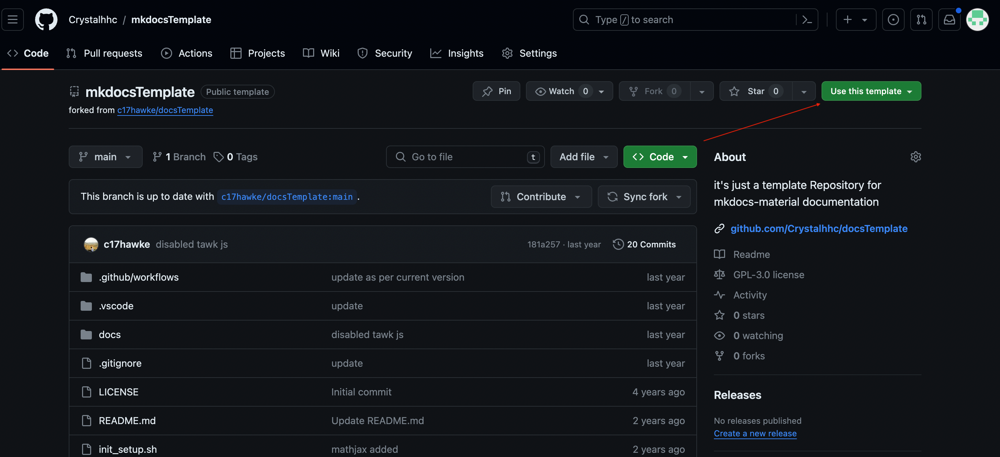
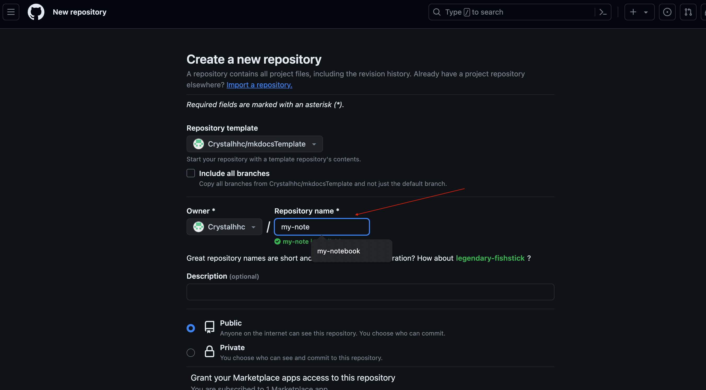
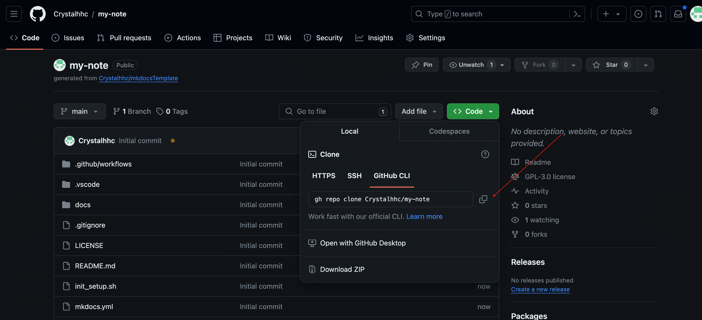

# How to Use mkdocsTemplate

## Template Repository
- [mkdocsTemplate](https://github.com/Crystalhhc/mkdocsTemplate)
## Create a new documentation website with the template
1. Use the template



2. Create a new Repo



3. Clone the created repo to your local


```sh
%gh repo clone Crystalhhc/my-note
```
4. Using VS Code to edit
```sh
code .
```
## Project Layout
```
├─ note
│  └─ .github
│  │  └─ workflows
│  │     └─ ci.yml
│  └─ init_setup.sh
│  └─ docs
│  │  └─ img
│  │  └─ index.md
│  └─ mkdocs.yml
│  └─ requirements.txt
└─ 
```


## Organize the Document Layout
```yml title="mkdocs.yml"
nav:
  - Home: index.md
  - Community:
    - Contributing:
      - contributing/index.md
      - Reporting a bug: contributing/reporting-a-bug.md
      - Reporting a docs issue: contributing/reporting-a-docs-issue.md
      - Requesting a change: contributing/requesting-a-change.md
      - Adding translations: contributing/adding-translations.md
      - Making a pull request: contributing/making-a-pull-request.md
      - Asking a question: https://github.com/squidfunk/mkdocs-material/discussions
    - Guides:
      - Creating a reproduction: guides/creating-a-reproduction.md
    - Community experts program:
      - insiders/community-experts-program/index.md
  - Blog:
    - blog/index.md
```

## Publish to Github Pages

